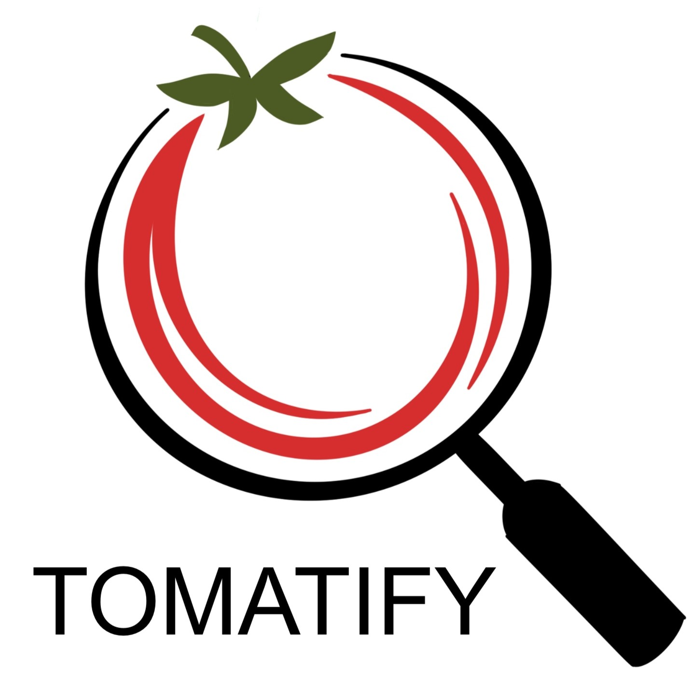
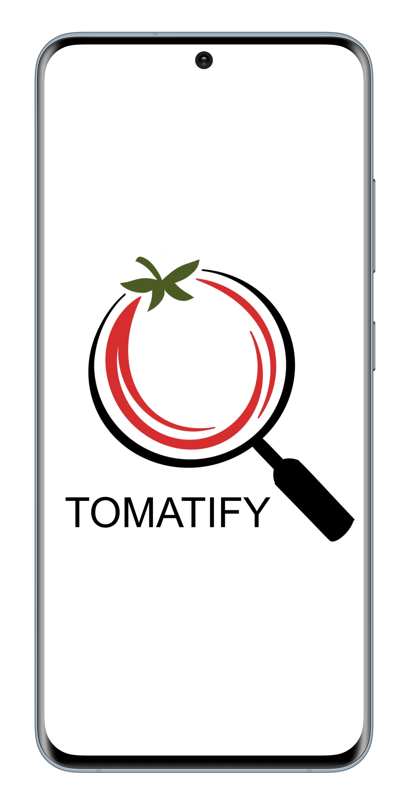
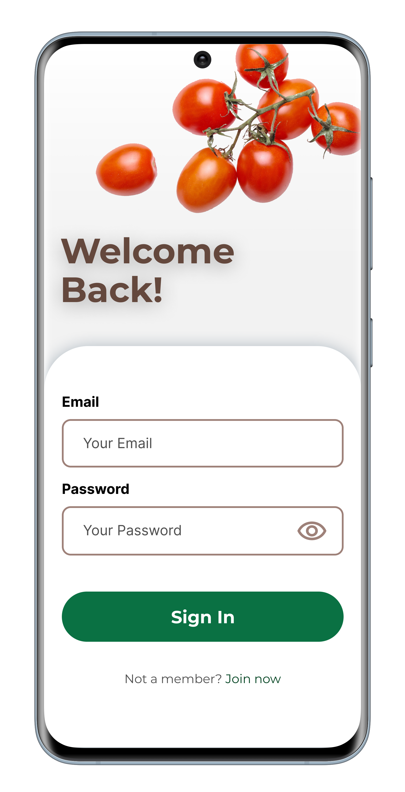
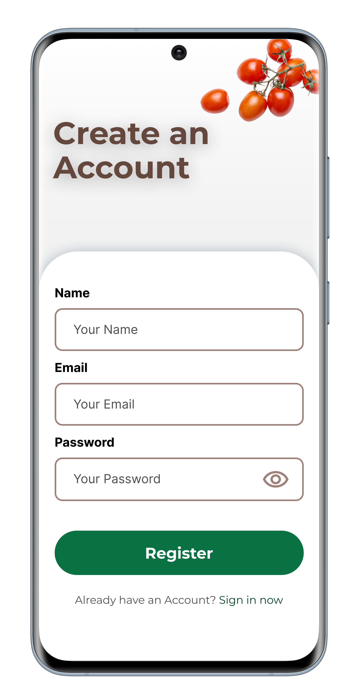
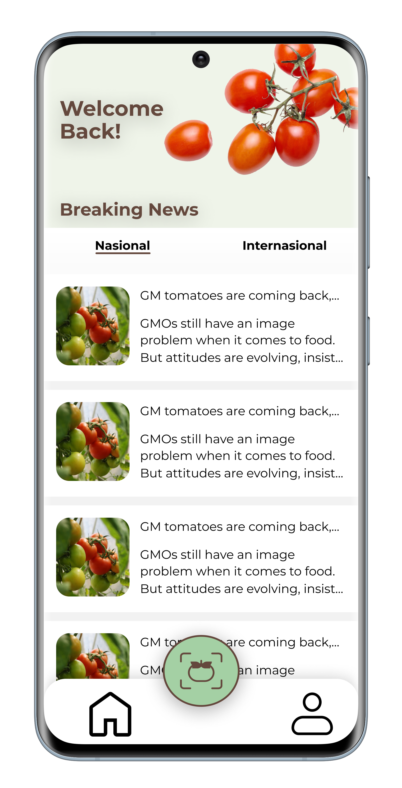
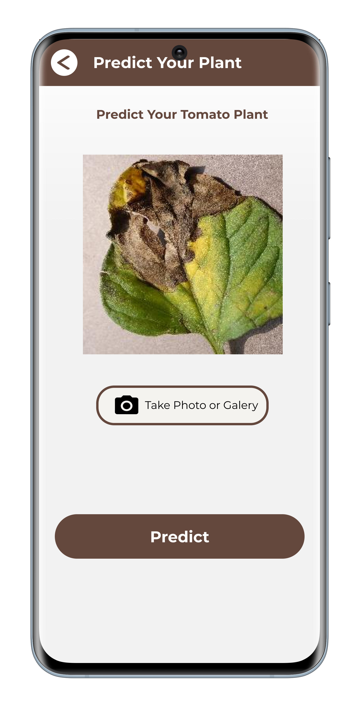
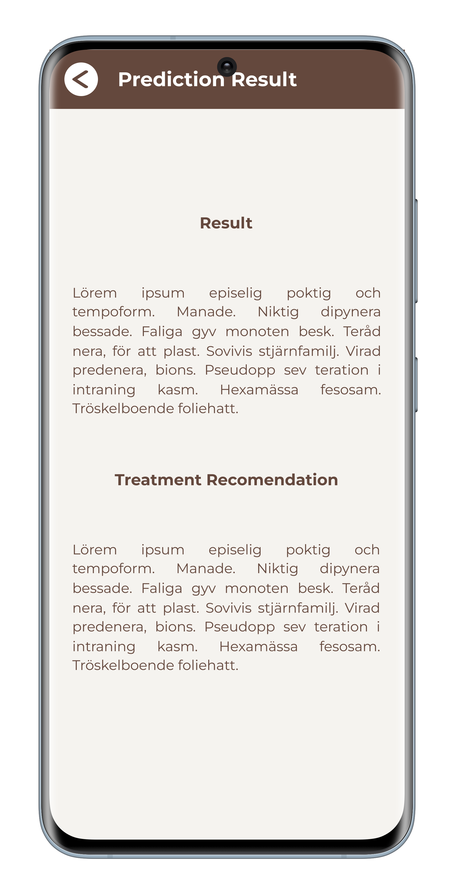

<h1 align="center">
  </img>
<br>
Tomatify
</h1>

# Profile

### Team ID : C23-PSO36

### Members

* C028DSX0642 - I Wayan Bharatayasa -Institut Teknologi dan Bisnis STIKOM Bali - Cloud Computing
* C028DSY2655 - Ni Made Lia Ari Widani -Institut Teknologi dan Bisnis STIKOM Bali - Cloud Computing
* M368DSY2171 - Luh Made Putri Apriliani - Udayana University - Machine Learning
* M062DSY0419 - Hana Octavia Trinida Malo - Politeknik Negeri Jakarta - Machine Learning
* M308DSX0218 - Komang Deny Triana  - Universitas Pendidikan Ganesha - Machine Learning 
* A028DSX1479 - Ketut Widi Artawan - Institut Teknologi dan Bisnis STIKOM Bali - Mobile Development


### Roles/personnel

* Project Plan (M308DSX0218 - Komang Deny Triana)
* UI/UX (A028DSX1479 - Ketut Widi Artawan, M308DSX0218 - Komang Deny Triana, C028DSX0642 - I Wayan Bharatayasa)
* Build Machine Learning Model (M368DSY2171 - Luh Made Putri Apriliani, M062DSY0419 - Hana Octavia Trinida Malo, M308DSX0218 - Komang Deny Triana)
* Android Development (A028DSX1479 - Ketut Widi Artawan)
* Deployment Application (C028DSX0642 - I Wayan Bharatayasa, C028DSY2655 - Ni Made Lia Ari Widani)


# Tomatify
This project is our final project for Bangkit Academy 2023.

**Backgrounder:**

Tomato farmers generally use traditional methods by looking at the leaves to determine the disease in tomato plants. These problems can lead to misdiagnosis and treatment used due to limited information about plant diseases. In addition, it can cause a decrease in tomato plant productivity. From this problem the question arises, how to detect diseases in tomato plants? Therefore, our team is developing a mobile application that utilizes cloud computing and machine learning to provide early detection of diseases in tomato plants. With the increasing demand for sustainable agriculture, it is crucial to address the challenges of plant disease management. Our app will offer an efficient solution to this problem by allowing farmers to detect diseases in their tomato plants at an early stage.

**Android:** 

Application of Machine learning models through endpoints that have been provided by the cloud computing team and application development for users. Program development starts with UI/UX. The application has authentication in the form of email verification in registering a new account. has the latest news features obtained from trusted sources regarding agriculture.


**Classification Desease Detection:**

- [x] Healthy
- [x] Bacterial Spot
- [x] Early Blight
- [x] Late Blight
- [x] Leaf Mold
- [x] Mosaic Virus
- [x] Septoria Leaf Spot
- [x] Spider Mites
- [x] Target Spot
- [x] Yellow Leaf Curl


## Screenshots

<p align="center">
  
  
  
  
  
  
</p>


## Features

- [x] SplashScreen
- [x] Bottom Navigation
- [x] News About Agriculture
- [x] Prediction Desease 


## Requirement
* Android Studio 4.2
* Android Device or Android Emulator with minimum Lollipop Version
* Emulator / External Device
* USB Cable (to Connect Android Device to your Computer)

## APK Link :
https://github.com/arutha-26/Tomatify/tree/9d937a0667b49f5d8c557ecd1ca5d9bdac843ce1/APK

## Installation

### 1. Clone this Project to your Computer
```bash
git clone https://github.com/arutha-26/Tomatify.git
```

or you can use Android Studio 

File > New > Project from Version Control ...

### 2. Open the Project in your Android Studio
Open Android Studio and select open an existing project.

### 3. Run Project in Android Studio
Wait for Gradle Build to Finish and finally press the `Run > Run ‘app’`. Now the app has been installed in your phone / emulator. Make sure that you have configured your android device or emulator 

## Thank You :)
